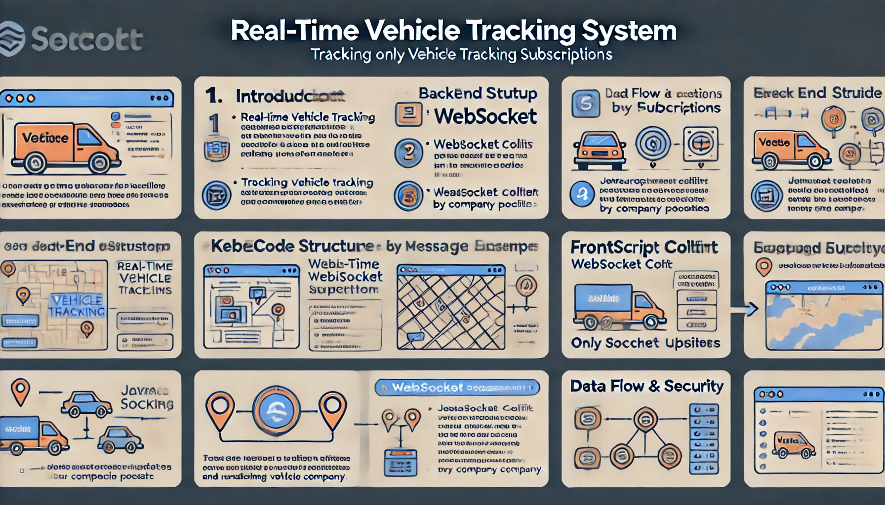

# omega-api
# Plataforma de Rastreo de Vehículos
Este proyecto es una plataforma de rastreo de vehículos que permite a cada usuario autenticado observar en el mapa únicamente los vehículos de su compañía. Utiliza WebSocket para la comunicación en tiempo real entre el backend y el frontend.



## Estructura de Implementación General

### 1. Configuración del WebSocket por Compañía
- Creación de un `WebSocketHandler` para gestionar las conexiones de WebSocket.
- Suscripción de cada sesión autenticada a los vehículos que pertenecen a la compañía del usuario.

### 2. Actualización de Ubicaciones
- Cuando un vehículo envíe una actualización de ubicación, el sistema enviará esta información solo a los usuarios conectados que pertenecen a la misma compañía.

### 3. Renderización en el Frontend
- El frontend actualizará la posición de cada vehículo en el mapa al recibir las coordenadas.

## Implementación en el Backend

# Plataforma de Rastreo de Vehículos

## Descripción
Esta plataforma permite rastrear vehículos en tiempo real.


### WebSocketHandler por Compañía
El siguiente código ilustra cómo configurar él `VehicleWebSocketHandler` para suscribirse a las ubicaciones de todos los vehículos de una compañía específica.

```java
@Component
public class VehicleWebSocketHandler extends TextWebSocketHandler {

    private final LocationService locationService;
    private final ObjectMapper objectMapper;
    private final Map<Long, Set<WebSocketSession>> companySessionsMap = new ConcurrentHashMap<>();

    public VehicleWebSocketHandler(LocationService locationService, ObjectMapper objectMapper) {
        this.locationService = locationService;
        this.objectMapper = objectMapper;
    }

    @Override
    public void afterConnectionEstablished(WebSocketSession session) throws Exception {
        Long companyId = getCompanyIdFromSession(session); // Obtener el ID de la compañía de la sesión
        companySessionsMap.computeIfAbsent(companyId, k -> ConcurrentHashMap.newKeySet()).add(session);
    }

    @Override
    public void handleTextMessage(WebSocketSession session, TextMessage message) throws Exception {
        VehicleLocationDTO location = objectMapper.readValue(message.getPayload(), VehicleLocationDTO.class);
        locationService.updateLocation(location);
        broadcastLocationToCompany(location.getCompanyId(), location);
    }

    private void broadcastLocationToCompany(Long companyId, VehicleLocationDTO location) {
        Set<WebSocketSession> sessions = companySessionsMap.get(companyId);
        if (sessions != null) {
            sessions.forEach(session -> {
                try {
                    if (session.isOpen()) {
                        session.sendMessage(new TextMessage(objectMapper.writeValueAsString(location)));
                    }
                } catch (IOException e) {
                    e.printStackTrace();
                }
            });
        }
    }

    @Override
    public void afterConnectionClosed(WebSocketSession session, CloseStatus status) {
        Long companyId = getCompanyIdFromSession(session);
        if (companyId != null) {
            Set<WebSocketSession> sessions = companySessionsMap.get(companyId);
            if (sessions != null) {
                sessions.remove(session);
                if (sessions.isEmpty()) {
                    companySessionsMap.remove(companyId);
                }
            }
        }
    }

    private Long getCompanyIdFromSession(WebSocketSession session) {
        return (Long) session.getAttributes().get("companyId");
    }
}

